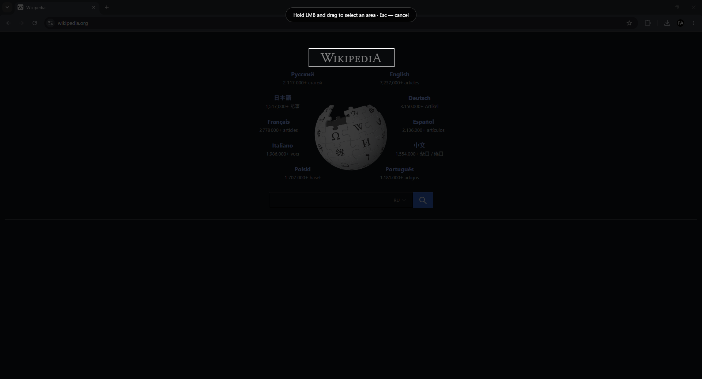
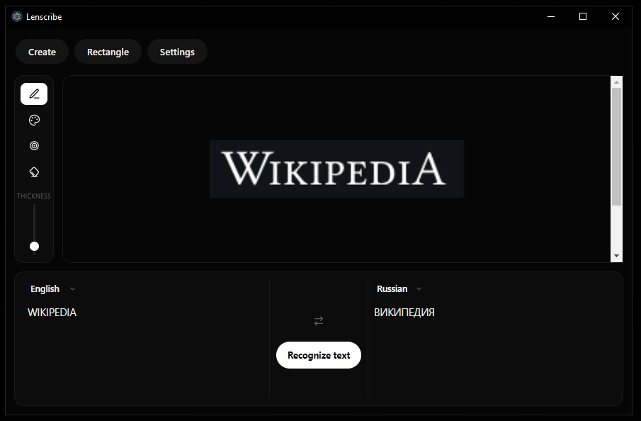

# Lenscribe

Screen OCR and translation tool. Select any area of your screen, extract the text, and translate it instantly.





## Features

- Screen area selection: rectangle and freehand modes
- OCR powered by Tesseract.js (English, Russian, Chinese, Spanish)
- Instant translation via Google Translate
- Built-in annotation tools: pencil, blur, eraser
- Zoom with mouse wheel
- Copy extracted text or translation to clipboard
- Interface available in English, Russian, Spanish, and Chinese
- Lightweight Electron app, no external services required for OCR

## Installation

### For users

Download the latest release from the [Releases page](../../releases) and run the installer.

### For developers

```bash
git clone https://github.com/fedasiaz/lenscribe.git
cd lenscribe
npm install
npm start